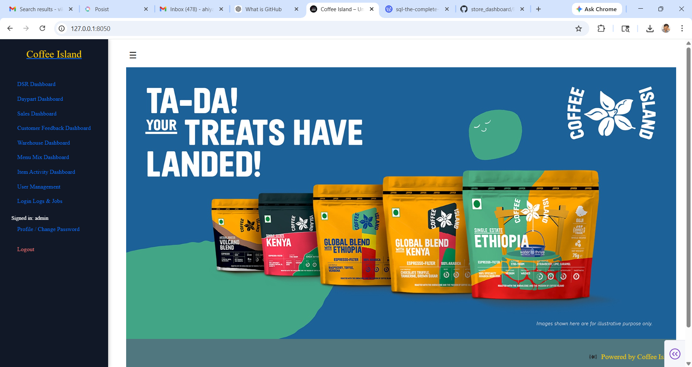

# Store Dashboard 📊

A Python-based analytics dashboard for store operations using SQL Server data.

This project provides insights into sales, inventory, and customer feedback through a simple dashboard interface.

---

## 🚀 Project Overview

This dashboard helps analyze store operations by integrating SQL data into a Python application.  
It provides visual insights into sales, stock, and customer feedback.

---

## 🚀 Features

- Sales analytics dashboard
- Inventory monitoring
- Store performance reports
- Customer feedback analysis
- SQL Server database integration
- Modular page structure for dashboard components

---

## 🛠 Technology Stack

- Python
- SQL Server
- Pandas
- SQLAlchemy
- Streamlit / Tkinter (depending on your UI)
- Git & GitHub

---

## 📂 Project Structure

store_dashboard/
│
├── main_app.py
├── pages/
│   ├── sales.py
│   ├── inventory.py
│   └── feedback.py
│
├── screenshots/
│   └── dashboard.png
│
└── README.md

---

## ⚙️ Installation

Clone the repository:

git clone https://github.com/kumarvikasarc-design/store_dashboard.git

Go to project folder:

cd store_dashboard

Install dependencies:

pip install -r requirements.txt

Run the application:

python main_app.py

---

## 📊 Dashboard Preview

---

## 💡 Key Features

- Sales performance dashboard
- Inventory tracking
- SQL database integration
- Modular Python architecture
- Easy to expand with new analytics modules

---

## 👤 Author

Vikash Kumar  
IT Operations | Data Analytics | Python & SQL Automation

GitHub:
https://github.com/kumarvikasarc-design

---

## ⭐ Support

If you like this project, please ⭐ the repository.
